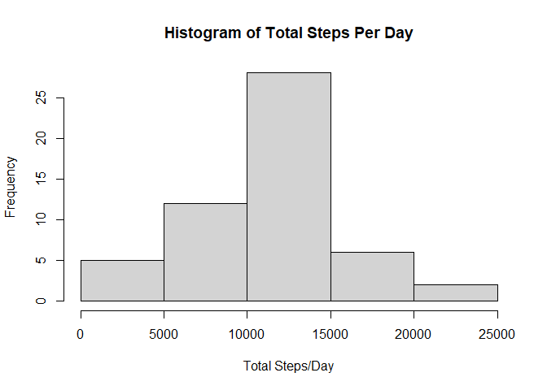

## Loading and preprocessing the data
Download the dataset: [Activity monitoring data](https://d396qusza40orc.cloudfront.net/repdata%2Fdata%2Factivity.zip)

* To avoid re-downloading data each time I knit, I am linking the zip file - store within 'data' folder in your working directory.


```r
## Date and time of file download from internet:
Sys.time()
```

```
## [1] "2023-10-23 15:12:31 EDT"
```
Required Packages

```r
library(data.table)
library(dplyr)
```

```
## 
## Attaching package: 'dplyr'
```

```
## The following objects are masked from 'package:data.table':
## 
##     between, first, last
```

```
## The following objects are masked from 'package:stats':
## 
##     filter, lag
```

```
## The following objects are masked from 'package:base':
## 
##     intersect, setdiff, setequal, union
```

```r
library(ggplot2)
```
Load the data:

```r
raw_activity <- fread("./data./activity.csv", header = TRUE, na.strings = "NA")
```

Take a look at the data:

```r
summary(raw_activity)
```

```
##      steps             date               interval     
##  Min.   :  0.00   Min.   :2012-10-01   Min.   :   0.0  
##  1st Qu.:  0.00   1st Qu.:2012-10-16   1st Qu.: 588.8  
##  Median :  0.00   Median :2012-10-31   Median :1177.5  
##  Mean   : 37.38   Mean   :2012-10-31   Mean   :1177.5  
##  3rd Qu.: 12.00   3rd Qu.:2012-11-15   3rd Qu.:1766.2  
##  Max.   :806.00   Max.   :2012-11-30   Max.   :2355.0  
##  NA's   :2304
```

```r
head(raw_activity)
```

```
##    steps       date interval
## 1:    NA 2012-10-01        0
## 2:    NA 2012-10-01        5
## 3:    NA 2012-10-01       10
## 4:    NA 2012-10-01       15
## 5:    NA 2012-10-01       20
## 6:    NA 2012-10-01       25
```

## What is mean total number of steps taken per day?

### 1. Calculate the total number of steps take per day


```r
table(raw_activity$date)
```

```
## 
## 2012-10-01 2012-10-02 2012-10-03 2012-10-04 2012-10-05 2012-10-06 2012-10-07 
##        288        288        288        288        288        288        288 
## 2012-10-08 2012-10-09 2012-10-10 2012-10-11 2012-10-12 2012-10-13 2012-10-14 
##        288        288        288        288        288        288        288 
## 2012-10-15 2012-10-16 2012-10-17 2012-10-18 2012-10-19 2012-10-20 2012-10-21 
##        288        288        288        288        288        288        288 
## 2012-10-22 2012-10-23 2012-10-24 2012-10-25 2012-10-26 2012-10-27 2012-10-28 
##        288        288        288        288        288        288        288 
## 2012-10-29 2012-10-30 2012-10-31 2012-11-01 2012-11-02 2012-11-03 2012-11-04 
##        288        288        288        288        288        288        288 
## 2012-11-05 2012-11-06 2012-11-07 2012-11-08 2012-11-09 2012-11-10 2012-11-11 
##        288        288        288        288        288        288        288 
## 2012-11-12 2012-11-13 2012-11-14 2012-11-15 2012-11-16 2012-11-17 2012-11-18 
##        288        288        288        288        288        288        288 
## 2012-11-19 2012-11-20 2012-11-21 2012-11-22 2012-11-23 2012-11-24 2012-11-25 
##        288        288        288        288        288        288        288 
## 2012-11-26 2012-11-27 2012-11-28 2012-11-29 2012-11-30 
##        288        288        288        288        288
```


```r
day_steps <- aggregate(steps ~ date, raw_activity, sum, na.action = NULL)
day_steps
```

```
##          date steps
## 1  2012-10-01    NA
## 2  2012-10-02   126
## 3  2012-10-03 11352
## 4  2012-10-04 12116
## 5  2012-10-05 13294
## 6  2012-10-06 15420
## 7  2012-10-07 11015
## 8  2012-10-08    NA
## 9  2012-10-09 12811
## 10 2012-10-10  9900
## 11 2012-10-11 10304
## 12 2012-10-12 17382
## 13 2012-10-13 12426
## 14 2012-10-14 15098
## 15 2012-10-15 10139
## 16 2012-10-16 15084
## 17 2012-10-17 13452
## 18 2012-10-18 10056
## 19 2012-10-19 11829
## 20 2012-10-20 10395
## 21 2012-10-21  8821
## 22 2012-10-22 13460
## 23 2012-10-23  8918
## 24 2012-10-24  8355
## 25 2012-10-25  2492
## 26 2012-10-26  6778
## 27 2012-10-27 10119
## 28 2012-10-28 11458
## 29 2012-10-29  5018
## 30 2012-10-30  9819
## 31 2012-10-31 15414
## 32 2012-11-01    NA
## 33 2012-11-02 10600
## 34 2012-11-03 10571
## 35 2012-11-04    NA
## 36 2012-11-05 10439
## 37 2012-11-06  8334
## 38 2012-11-07 12883
## 39 2012-11-08  3219
## 40 2012-11-09    NA
## 41 2012-11-10    NA
## 42 2012-11-11 12608
## 43 2012-11-12 10765
## 44 2012-11-13  7336
## 45 2012-11-14    NA
## 46 2012-11-15    41
## 47 2012-11-16  5441
## 48 2012-11-17 14339
## 49 2012-11-18 15110
## 50 2012-11-19  8841
## 51 2012-11-20  4472
## 52 2012-11-21 12787
## 53 2012-11-22 20427
## 54 2012-11-23 21194
## 55 2012-11-24 14478
## 56 2012-11-25 11834
## 57 2012-11-26 11162
## 58 2012-11-27 13646
## 59 2012-11-28 10183
## 60 2012-11-29  7047
## 61 2012-11-30    NA
```

### 2. Make a histogram of the total number of steps take each day


```r
hist(day_steps$steps, xlab = "Total Steps/Day", main = "Histogram of Total Steps Per Day")
```

<!-- -->

### 3) Calculate and report the mean and median of the total number of steps taken per day


```r
mean(day_steps$steps, na.rm = TRUE)
```

```
## [1] 10766.19
```

```r
median(day_steps$steps,na.rm = TRUE)
```

```
## [1] 10765
```

## What is the average daily activity pattern?

### 1) Make a time series plot (i.e. type = "l") of the 5-minute interval (x-axis) and the average number of steps take, averaged across all days (y-axis)

Aggregate the average number of steps by interval:


```r
ave_itv <- aggregate(steps ~ interval, raw_activity, mean)
summary(ave_itv)
```

```
##     interval          steps        
##  Min.   :   0.0   Min.   :  0.000  
##  1st Qu.: 588.8   1st Qu.:  2.486  
##  Median :1177.5   Median : 34.113  
##  Mean   :1177.5   Mean   : 37.383  
##  3rd Qu.:1766.2   3rd Qu.: 52.835  
##  Max.   :2355.0   Max.   :206.170
```

Create th plot


```r
plot(ave_itv, type = "l", main = "Average Steps by Interval")
```

<!-- -->


### 2) Which 5-minute interval, on average across all the days in the dataset, contains the maximum number of steps?


```r
itv_max <- which.max(ave_itv$steps)
ave_itv[itv_max, ]
```

```
##     interval    steps
## 104      835 206.1698
```

## Imputing missing values

### 1) Calculare and report the total number of missing values in the dataset (i.e. the total number of rows with NAs)


```r
na_count <- is.na(raw_activity)
sum(na_count)
```

```
## [1] 2304
```

### 2) Devise a strategy for filling in all of the missing values in the dataset. The strategy doesn not need to be sophisticated. For example, you could use the mean/median for that day, or the mean for that 5-minute interval, etc.

Lets see if these NA's are concentrated in any interval or date?


```r
na_steps <- raw_activity
na_steps$na <- is.na(na_steps$steps)
head(na_steps)
```

```
##    steps       date interval   na
## 1:    NA 2012-10-01        0 TRUE
## 2:    NA 2012-10-01        5 TRUE
## 3:    NA 2012-10-01       10 TRUE
## 4:    NA 2012-10-01       15 TRUE
## 5:    NA 2012-10-01       20 TRUE
## 6:    NA 2012-10-01       25 TRUE
```

Plot number of NAs by date


```r
na_dates <- aggregate(na ~ date, na_steps, sum)
na_itv <- aggregate(na ~ interval, na_steps, sum)
par(mfrow = c(1, 2))
plot(na_dates, main = "NA Count by Date")
plot(na_itv, main = "NA Count by Interval")
```

<!-- -->

Appears as if no data was able to be collected on 8 different dates

* 8 days  are completely missing data - all NAs.
* Every interval is missing exactly 8 entries 

Found a useful package: mice

```r
library(mice)
```

```
## 
## Attaching package: 'mice'
```

```
## The following object is masked from 'package:stats':
## 
##     filter
```

```
## The following objects are masked from 'package:base':
## 
##     cbind, rbind
```
Lets try 3 different methods imputing the data and compare histograms

* pmm: predictive mean matching
* cart: classification and regression trees
* lasso.norm: lasso linear regression


```r
activity_imputed <- data.frame(
    original = raw_activity$steps,
    pmm_steps = complete(mice(raw_activity, method = "pmm"))$steps,
    cart_steps = complete(mice(raw_activity, method = "cart"))$steps,
    lasso_steps = complete(mice(raw_activity, method = "lasso.norm"))$steps
)
```

```
## 
##  iter imp variable
##   1   1  steps
##   1   2  steps
##   1   3  steps
##   1   4  steps
##   1   5  steps
##   2   1  steps
##   2   2  steps
##   2   3  steps
##   2   4  steps
##   2   5  steps
##   3   1  steps
##   3   2  steps
##   3   3  steps
##   3   4  steps
##   3   5  steps
##   4   1  steps
##   4   2  steps
##   4   3  steps
##   4   4  steps
##   4   5  steps
##   5   1  steps
##   5   2  steps
##   5   3  steps
##   5   4  steps
##   5   5  steps
## 
##  iter imp variable
##   1   1  steps
##   1   2  steps
##   1   3  steps
##   1   4  steps
##   1   5  steps
##   2   1  steps
##   2   2  steps
##   2   3  steps
##   2   4  steps
##   2   5  steps
##   3   1  steps
##   3   2  steps
##   3   3  steps
##   3   4  steps
##   3   5  steps
##   4   1  steps
##   4   2  steps
##   4   3  steps
##   4   4  steps
##   4   5  steps
##   5   1  steps
##   5   2  steps
##   5   3  steps
##   5   4  steps
##   5   5  steps
## 
##  iter imp variable
##   1   1  steps
##   1   2  steps
##   1   3  steps
##   1   4  steps
##   1   5  steps
##   2   1  steps
##   2   2  steps
##   2   3  steps
##   2   4  steps
##   2   5  steps
##   3   1  steps
##   3   2  steps
##   3   3  steps
##   3   4  steps
##   3   5  steps
##   4   1  steps
##   4   2  steps
##   4   3  steps
##   4   4  steps
##   4   5  steps
##   5   1  steps
##   5   2  steps
##   5   3  steps
##   5   4  steps
##   5   5  steps
```

```r
summary(activity_imputed)
```

```
##     original        pmm_steps        cart_steps      lasso_steps     
##  Min.   :  0.00   Min.   :  0.00   Min.   :  0.00   Min.   :-341.52  
##  1st Qu.:  0.00   1st Qu.:  0.00   1st Qu.:  0.00   1st Qu.:   0.00  
##  Median :  0.00   Median :  0.00   Median :  0.00   Median :   0.00  
##  Mean   : 37.38   Mean   : 36.35   Mean   : 36.03   Mean   :  37.18  
##  3rd Qu.: 12.00   3rd Qu.: 10.00   3rd Qu.: 10.00   3rd Qu.:  26.00  
##  Max.   :806.00   Max.   :806.00   Max.   :806.00   Max.   : 806.00  
##  NA's   :2304
```

Visualize the distributions


```r
library(gridExtra)
```

```
## 
## Attaching package: 'gridExtra'
```

```
## The following object is masked from 'package:dplyr':
## 
##     combine
```

```r
og_hist <- ggplot(activity_imputed, aes(x = original)) + geom_histogram() + 
    ggtitle("Original")
pmm_hist <- ggplot(activity_imputed, aes(x = pmm_steps)) + geom_histogram() + 
    ggtitle("pmm")
cart_hist <- ggplot(activity_imputed, aes(x = cart_steps)) + geom_histogram() + 
    ggtitle("cart")
lasso_hist <- ggplot(activity_imputed, aes(x = lasso_steps)) + geom_histogram() + 
    ggtitle("lasso")
grid.arrange(og_hist, pmm_hist, cart_hist, lasso_hist, nrow = 2, ncol = 2)
```

```
## `stat_bin()` using `bins = 30`. Pick better value with `binwidth`.
```

```
## Warning: Removed 2304 rows containing non-finite values (`stat_bin()`).
```

```
## `stat_bin()` using `bins = 30`. Pick better value with `binwidth`.
```

```
## `stat_bin()` using `bins = 30`. Pick better value with `binwidth`.
## `stat_bin()` using `bins = 30`. Pick better value with `binwidth`.
```

<!-- -->
Looking at these plots:

* Lasso provides negative data, can't have negative steps.
* Cart and pmm seem to deliver the same product.

Lets use predictive mean matching to impute

### 3. Create a new dataset that is equal to the original dataset but with the missing data filled in


```r
imputed_activity <- data.frame(steps <- activity_imputed$pmm_steps, 
                               date <- raw_activity$date, 
                               interval <- raw_activity$interval)
head(imputed_activity)
```

```
##   steps....activity_imputed.pmm_steps date....raw_activity.date
## 1                                  47                2012-10-01
## 2                                   0                2012-10-01
## 3                                   0                2012-10-01
## 4                                   0                2012-10-01
## 5                                   0                2012-10-01
## 6                                   0                2012-10-01
##   interval....raw_activity.interval
## 1                                 0
## 2                                 5
## 3                                10
## 4                                15
## 5                                20
## 6                                25
```

### 4. Make a histogram of the total number of steps taken each day and calculatate and report the **mean** and **median** total number of steps taken per day. Do these values differ from the estimates from the first part of the assignment? What is the impact of imputing missing data on the estimates of the total daily number of steps?

Create a new dataframe relaying total steps per day with imputed step counts


```r
names(imputed_activity)
```

```
## [1] "steps....activity_imputed.pmm_steps" "date....raw_activity.date"          
## [3] "interval....raw_activity.interval"
```
Yikes, ok fix these names


```r
imputed_activity <- setNames(imputed_activity, c("steps", "date", "interval"))
names(imputed_activity)
```

```
## [1] "steps"    "date"     "interval"
```


```r
day_steps_imp <- aggregate(steps ~ date, imputed_activity, sum)
head(day_steps_imp)
```

```
##         date steps
## 1 2012-10-01  7849
## 2 2012-10-02   126
## 3 2012-10-03 11352
## 4 2012-10-04 12116
## 5 2012-10-05 13294
## 6 2012-10-06 15420
```
Make the histogram:


```r
hist(day_steps_imp$steps, main = "Total Steps by Day")
```

<!-- -->

Compare mean and medium before and after imputing NA values


```r
mean_raw <- mean(day_steps$steps, na.rm = TRUE)
median_raw <- median(day_steps$steps,na.rm = TRUE)
mean_imp <- mean(day_steps_imp$steps)
median_imp <- median(day_steps_imp$steps)
comp_matrix <- matrix(nrow = 2, ncol = 2, dimnames = list(c("raw", "imputed"), c("mean", "median")))
comp_matrix[ , 1] = c(mean_raw, mean_imp)
comp_matrix[ , 2] = c(median_raw, median_imp)
comp_matrix
```

```
##             mean median
## raw     10766.19  10765
## imputed 10470.00  10439
```

Both the mean and median values were reduced when imputing data based on pmm values.

## Are there differences in activity patterns between weekdays and weekends?

### 1) Create a new factor variable in the dataset with two levels - "weekday" and "weekend" indicating whether a given date is a weekday or a weekend day.

Create a list relaying days of the week

```r
day_name <- weekdays(imputed_activity$date, abbreviate = TRUE)
table(day_name)
```

```
## day_name
##  Fri  Mon  Sat  Sun  Thu  Tue  Wed 
## 2592 2592 2304 2304 2592 2592 2592
```
Create a list indicating if the day is a weekend


```r
weekend <- ifelse(day_name %in% c("Sat", "Sun"), TRUE, FALSE)
class(weekend)
```

```
## [1] "logical"
```

```r
table(weekend)
```

```
## weekend
## FALSE  TRUE 
## 12960  4608
```
Add that list to the data table

```r
imputed_activity$weekend <- as.factor(weekend)
summary(imputed_activity)
```

```
##      steps             date               interval       weekend     
##  Min.   :  0.00   Min.   :2012-10-01   Min.   :   0.0   FALSE:12960  
##  1st Qu.:  0.00   1st Qu.:2012-10-16   1st Qu.: 588.8   TRUE : 4608  
##  Median :  0.00   Median :2012-10-31   Median :1177.5                
##  Mean   : 36.35   Mean   :2012-10-31   Mean   :1177.5                
##  3rd Qu.: 10.00   3rd Qu.:2012-11-15   3rd Qu.:1766.2                
##  Max.   :806.00   Max.   :2012-11-30   Max.   :2355.0
```

### 2. Make a panel plot containing a time series plot (i.e. type = "l") of the 5-minute interval (x-axis) and the average number of steps taken, averaged across all weekday days or weekend days (y-axis)


```r
ggplot(activity_imputed, aes(x = interval, y = steps)) + geom_line() + 
    facet_grid(rows = weekend)
```

<!-- -->
